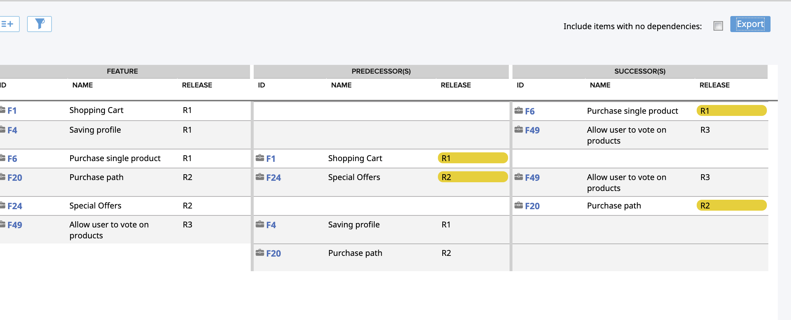

# Story/Feature Dependency Schedule

## Summary/Description

Show stories (or Portfolio Items) and their dependencies. Color code the dependencies based on their
schedule. The app respects page-level timebox filtering for those types that support it

The app can also be configured to show  dependencies and colors dependencies based
on start dates. The app will automatically detect the name of the 
portfolio items ( portfolioitem/feature is the default ), so this will work in environments that have
customized portfolio item names.

For higher level portfolio items (i.e. above features), the app will colour code both of the main artefacts start/end dates with the current 'health' colout of the artefact.

When you select Features, the app defaults to use the 'Release' field and not the start/end dates

By default, only items with dependencies are shown, but this can be changed within the app.

### Colors Used:
* Primary Artifact Colors
  * Grey - primary artifact is unscheduled. No colors used for predecessors or successors
* Predecessor Colors
  * Red - predecessor is scheduled AFTER the primary artifact
  * Yellow - predecessor is scheduled in the same timebox as the primary artifact
* Successor Colors
  * Red - successor is scheduled BEFORE the primary artifact
  * Yellow - successor is scheduled in the same timebox as the primary artifact
  * Grey - successor is unscheduled 
